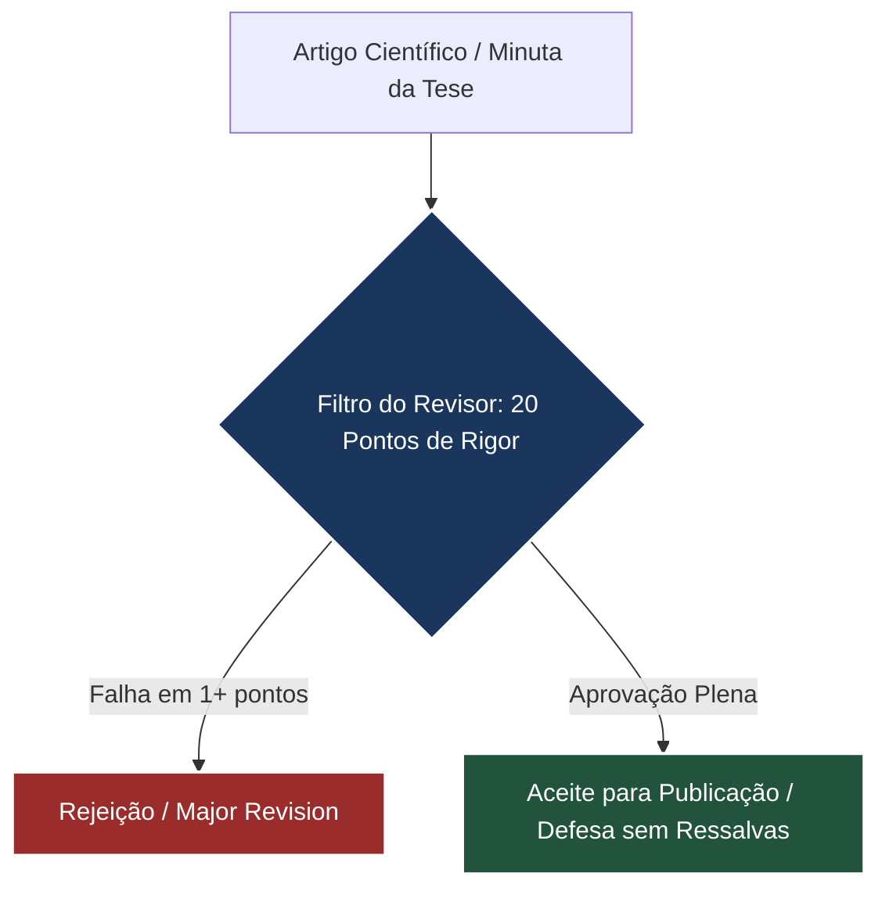

# 🔍 DIRETRIZES DO AVALIADOR AD-HOC (DOUBLE-BLIND PEER REVIEW)
## Parecer de Alto Impacto para Tese de Doutorado e Artigos Científicos
**Instituição de Referência de Avaliação:** Fucape Business School • Doutorado em Contabilidade e Administração
**Perfil do Avaliador:** Cientista-Chefe, Livre-Docente em Contabilidade Pública, Pesquisador Produtividade CNPq Nível 1A, com foco em Métodos Quantitativos, Processamento de Linguagem Natural (PLN) e *Design Science Research* (DSR) aplicados à Administração Pública.

---

> [!IMPORTANT]
> **Propósito do Revisor Cego (Blind Reviewer):**
> Este documento funciona como um espelho de avaliação de periódicos internacionais de alto impacto (Scopus Q1 / Web of Science / RAC / RAP). O tom é estritamente severo, clínico, profissional e focado no rigor científico extremo. Cada artigo da tese e o corpo da tese como um todo devem ser submetidos à chancela dos **20 critérios de escrutínio** estabelecidos a seguir antes de serem consolidados.

---



---

## 🎯 EIXO I: RIGOR EPISTEMOLÓGICO E DESIGN SCIENCE RESEARCH (DSR)

### 1. Articulação entre o Artefato e a Teoria de Fundo (*Kernel Theory*)
*   **O Escrutínio do Avaliador:** O artefato computacional (o Copiloto Algorítmico) não pode ser apresentado apenas como uma solução de engenharia ou ferramenta prática ("ferramentalismo ingênuo"). O autor deve explicitar qual teoria das ciências naturais, sociais ou comportamentais fornece a base conceitual para o design do artefato (conforme *Gregor & Jones, 2007*).
*   **Red Flags (Sinais de Alerta):** Descrição puramente técnica do código ou da API sem conectá-la a conceitos como Assimetria de Informação, Custos de Transação ou Teoria da Agência.
*   **Diretriz de Correção Rigorosa:** Cada componente do artefato deve ser justificado por uma hipótese teórica. Exemplo: *"A interface de simplificação léxica do artefato baseia-se na mitigação dos limites da racionalidade limitada dos proponentes ex-ante, conforme Williamson (1985)"*.

### 2. Rigor e Maturidade na Avaliação do Artefato (*FEDS Framework*)
*   **O Escrutínio do Avaliador:** Como o artefato foi testado? A avaliação científica de um artefato DSR exige um design de avaliação estruturado. O autor aplicou o *Framework for Evaluation in Design Science (FEDS)* de *Venable et al. (2016)*? A avaliação é artificial (laboratório, simulação) ou naturalista (uso real em órgãos públicos)?
*   **Red Flags (Sinais de Alerta):** Declarações vagas de que o artefato é "útil" ou "eficaz" sem testes empíricos controlados, análise estatística de desempenho ou testes com usuários reais (gestores e licitantes).
*   **Diretriz de Correção Rigorosa:** Desenhar e relatar formalmente a estratégia de avaliação DSR, detalhando as etapas ex-ante e ex-post, métricas de acurácia, testes A/B de legibilidade e surveys com licitantes reais.

### 3. Delimitação das Contribuições de DSR (*Gregor & Hevner, 2013*)
*   **O Escrutínio do Avaliador:** Qual é o tipo de contribuição de DSR deste trabalho de acordo com a matriz de conhecimento de *Gregor & Hevner (2013)*? Trata-se de uma *Inovação* (problema novo, solução nova), um *Aprimoramento* (problema conhecido, solução melhorada) ou uma *Exaptação* (aplicação de solução conhecida a problema novo)?
*   **Red Flags (Sinais de Alerta):** Omissão da classificação da contribuição DSR, ou alegações de "inovação revolucionária" para a mera aplicação de APIs comerciais de Large Language Models (LLMs) sem refinamento ou arquitetura proprietária.
*   **Diretriz de Correção Rigorosa:** Declarar expressamente na metodologia: *"Esta pesquisa enquadra-se como um Aprimoramento (Improvement) no quadrante de contribuição de Gregor & Hevner (2013), pois desenvolve uma nova arquitetura algorítmica para mitigar o problema conhecido de opacidade textual em contratações complexas"*.

---

## 📊 EIXO II: CONSISTÊNCIA METODOLÓGICA E RIGOR EMPÍRICO

### 4. Representatividade, Viés e Validade Externa da Amostra
*   **O Escrutínio do Avaliador:** A base de dados utilizada é estatisticamente representativa? Quais foram os critérios de amostragem (probabilística ou não-probabilística)? O modelo padece de viés de seleção ou viés de sobrevivência? A pesquisa foca apenas no nível federal ou é generalizável para o nível subnacional (estados e municípios)?
*   **Red Flags (Sinais de Alerta):** Amostras pequenas (ex: focar em apenas 5 editais) e tentar generalizar conclusões estatísticas para todo o ecossistema brasileiro de contratações públicas de inovação.
*   **Diretriz de Correção Rigorosa:** Sempre que utilizar amostras reduzidas, classificar explicitamente como "estudo exploratório piloto" e conduzir testes estatísticos de poder de amostra (*Power Analysis*). Apresentar o processo de filtragem de dados através de fluxogramas transparentes.

### 5. Robustez dos Modelos Econométricos e Supostos Regressivos
*   **O Escrutínio do Avaliador:** Para os artigos quantitativos (Regressão, Kaplan-Meier, DEA), os supostos dos modelos estatísticos foram validados? Onde estão os testes de heterocedasticidade (ex: teste de Breusch-Pagan), autocorrelação dos resíduos (ex: Durbin-Watson), multicolinearidade (VIF - *Variance Inflation Factor*) e normalidade dos resíduos (Shapiro-Wilk)?
*   **Red Flags (Sinais de Alerta):** Apresentar tabelas de regressão ordinária (MQO) sem relatar se os erros-padrão foram corrigidos por matrizes robustas (ex: correção de White ou clusterização por órgão público).
*   **Diretriz de Correção Rigorosa:** Reportar integralmente as estatísticas de diagnóstico do modelo econométrico nas notas das tabelas ou em apêndices metodológicos, justificando escolhas de variáveis de controle e dummies temporais/geográficas.

### 6. Transparência Algorítmica e Pré-Processamento de Dados de NLP
*   **O Escrutínio do Avaliador:** A pipeline de processamento de linguagem natural (PLN) está descrita de forma reprodutível? Quais dicionários de stop words foram aplicados? Houve lematização ou radicalização (*stemming*) das palavras? Como foram tratados caracteres especiais e termos técnicos jurídicos na tokenização?
*   **Red Flags (Sinais de Alerta):** Expressões genéricas como *"os dados foram limpos e processados no Python"* sem explicitar bibliotecas (NLTK, spaCy, Scikit-Learn), sementes aleatórias (*random seeds*) ou hiperparâmetros de tokenização.
*   **Diretriz de Correção Rigorosa:** Apresentar a especificação exata do pré-processamento de PLN: *"A normalização de texto removeu numerais e pontuação, converteu os caracteres para caixa baixa, filtrou stopwords através da lista estendida do NLTK (183 tokens) e utilizou o lematizador do modelo 'pt_core_news_lg' do spaCy v3.5"*.

### 7. Validação Epistêmica das Métricas Adotadas (ex: Flesch-Kincaid)
*   **O Escrutínio do Avaliador:** O Índice de Legibilidade Flesch-Kincaid (FK) foi calibrado para o português brasileiro? O FK é baseado na contagem silábica de palavras, mas a estrutura morfológica da língua portuguesa difere sensivelmente da inglesa. O autor considerou as fórmulas adaptadas (como *Martins et al., 1996*)? A métrica penaliza indevidamente termos técnicos necessários do jargão licitatório?
*   **Red Flags (Sinais de Alerta):** Aplicação cega de algoritmos de contagem de legibilidade baseados no inglês a textos em português, gerando distorções graves nos escores de leitura.
*   **Diretriz de Correção Rigorosa:** Justificar a escolha da métrica, citando a literatura brasileira de adaptação do índice, e contrastar o FK com outras métricas de complexidade textual (como a densidade lexical, índice Gunning-Fog ou métricas de diversidade de vocabulário como TTR - *Type-Token Ratio*).

---

## 💡 EIXO III: CONTRIBUIÇÃO TEÓRICA E DIÁLOGO CIENTÍFICO

### 8. Originalidade e Contribuição Marginal Incremental
*   **O Escrutínio do Avaliador:** Qual é a real contribuição inédita desta tese em relação ao estado da arte internacional? Pesquisas internacionais já correlacionam clareza contratual com competitividade. Qual é o diferencial específico no contexto da inovação pública no Sul Global (especificamente sob a governança fiscal/administrativa brasileira)?
*   **Red Flags (Sinais de Alerta):** Conclusões óbvias que apenas repetem o bom senso comum (ex: *"editais difíceis atraem menos empresas"*) sem aprofundar os mecanismos causais específicos da burocracia ou da assimetria informacional em mercados emergentes.
*   **Diretriz de Correção Rigorosa:** Destacar na discussão o diferencial teórico: *"Este estudo estende a literatura clássica de custos de transação ao provar que a opacidade textual atua como uma barreira institucional silenciosa e altamente regressiva, penalizando desproporcionalmente startups e agentes inovadores de menor porte no Brasil"*.

### 9. Diálogo com a Literatura Seminal e Monitor de Referências
*   **O Escrutínio do Avaliador:** O referencial teórico está apoiado em artigos clássicos bem consolidados e contemporâneos indexados nas bases de dados internacionais de alto impacto (Scopus/Web of Science)? O autor utilizou e citou as referências do **Monitor de Referências** para fundamentar cada eixo empírico e metodológico?
*   **Red Flags (Sinais de Alerta):** Citação excessiva de monografias locais, relatórios governamentais informais ou blogs de internet em detrimento de publicações em periódicos com revisão por pares (*peer-reviewed*).
*   **Diretriz de Correção Rigorosa:** Assegurar que toda afirmação científica de base teórica esteja chancelada por publicações robustas (ex: *Mazzucato, 2013; Williamson, 1985; Hevner et al., 2004*), organizando as referências em ordem alfabética estrita e em total conformidade ABNT/APA.

### 10. Implicações Reais para Formulação de Políticas Públicas (*Policy Implications*)
*   **O Escrutínio do Avaliador:** A tese oferece diretrizes pragmáticas e acionáveis para administradores públicos e tomadores de decisão ou fica apenas no campo teórico abstrato? Como os achados econométricos podem alterar a rotina de controle governamental das contratações?
*   **Red Flags (Sinais de Alerta):** Recomendações genéricas e inócuas do tipo *"é preciso melhorar o treinamento dos servidores"* ou *"o governo deve ser mais transparente"*.
*   **Diretriz de Correção Rigorosa:** Propor diretrizes objetivas de políticas públicas fundadas nos achados empíricos. Exemplo: *"Recomenda-se a adoção de um teto legal de complexidade textual (limiar mínimo de escore Flesch-Kincaid de 30 pontos) para editais de contratações de inovação como critério de validade de publicação no PNCP"*.

---

## ✍️ EIXO IV: ESTRUTURA, COESÃO E LINGUAGEM ACADÊMICA

### 11. Rigor Linguístico e Eliminação de Clichês Algorítmicos
*   **O Escrutínio do Avaliador:** O texto está redigido em português cultíssimo, formal, conciso e com distanciamento científico absoluto? Foram eliminados termos valorativos (como *"revolucionário"*, *"excelente"*, *"maravilhoso"*)? Foram eliminadas palavras marcadoras e termos robóticos de preenchimento típicos de IA generativa (como *"adicionalmente"*, *"em suma"*, *"por fim"* repetidos em parágrafos consecutivos)?
*   **Red Flags (Sinais de Alerta):** Uso de jargão coloquial, excesso de voz passiva sem sujeito definido, gerundismos (ex: *"estará demonstrando que..."*) e termos de autopromoção exagerada dos próprios resultados.
*   **Diretriz de Correção Rigorosa:** Revisar sistematicamente cada linha, assegurando que o vocabulário seja sóbrio e rigorosamente técnico. Exemplo: substituir *"este gráfico maravilhoso mostra..."* por *"a análise da dispersão empírica apresentada na Figura 1 revela..."*.

### 12. Densidade e Variedade de Coesão Textual (Regra dos Conectivos)
*   **O Escrutínio do Avaliador:** Há fluidez lógica na progressão das frases e parágrafos? O autor utiliza elementos de coesão textual adequados para guiar o leitor no raciocínio científico?
*   **Red Flags (Sinais de Alerta):** Sentenças soltas sem transições textuais, parágrafos que começam abruptamente sem ligamento lógico com o parágrafo anterior, ou repetição obsessiva do mesmo conectivo (ex: começar três parágrafos seguidos com *"Adicionalmente"* ou *"Portanto"*).
*   **Diretriz de Correção Rigorosa:** Aplicar rigorosamente a regra de transição textual estabelecida: *toda frase após um ponto final e todo novo parágrafo devem iniciar com um conector ou elemento de coesão lógico variado* (ex: *Nesse sentido, Consequentemente, Dessa forma, Sob essa perspectiva, Por outro lado, Logo*).

### 13. Integridade e Cruzamento Cruzado de Referências Bibliográficas
*   **O Escrutínio do Avaliador:** Existe uma correspondência biunívoca exata entre os autores citados no corpo do texto e a lista de referências ao final da obra? Não há autores citados que foram omitidos nas referências ou vice-versa? As datas de publicação estão idênticas nos dois locais?
*   **Red Flags (Sinais de Alerta):** Citar *"Hevner (2004)"* no texto e registrar *"Hevner (2007)"* nas referências, ou listar referências que nunca foram efetivamente discutidas ao longo dos capítulos.
*   **Diretriz de Correção Rigorosa:** Realizar um cruzamento manual rigoroso letra por letra de todas as citações e referências antes de qualquer submissão de versão final.

---

## 🎨 EIXO V: APRESENTAÇÃO E VISUALIZAÇÃO CIENTÍFICA DE DADOS

### 14. Adequação Técnica de Tabelas Científicas (Normas ABNT/IBGE)
*   **O Escrutínio do Avaliador:** As tabelas estão estruturadas seguindo o padrão oficial acadêmico de publicação (normas do IBGE / APA / ABNT)?
*   **Red Flags (Sinais de Alerta):** Tabelas poluídas com grids internos e verticais pesados (parecendo planilhas de Excel), falta de indicação clara da fonte dos dados, ausência de títulos numerados adequados ou notas explicativas.
*   **Diretriz de Correção Rigorosa:** Tabelas científicas acadêmicas devem ter *apenas* linhas horizontais de demarcação (no topo do cabeçalho, na base do cabeçalho e na base inferior da tabela). Não devem conter bordas verticais ou preenchimentos de fundo cinza escuro de células.

### 15. Estética e Rigor de Gráficos Científicos (*Tufte-Style*)
*   **O Escrutínio do Avaliador:** Os gráficos possuem alta densidade de dados e simplicidade estética? A escolha de fontes e cores é harmoniosa e segue os padrões estabelecidos na ciência?
*   **Red Flags (Sinais de Alerta):** Gráficos coloridos demais, fundos cinzas ou pretos com linhas de grade grossas e invasivas, eixos sem descrição ou rótulos de unidades cortados.
*   **Diretriz de Correção Rigorosa:** Os gráficos devem adotar o estilo de Edward Tufte (alto coeficiente de *data-ink ratio*). Utilizar eixos finos descritos adequadamente, grades de fundo muito suaves (`alpha=0.3`), paleta monocromática ou azul acadêmico sóbrio, e exportação vetorial de alta resolução (300 DPI).

---

## 🔗 EIXO VI: INTEGRIDADE DA TESE E ALINHAMENTO

### 16. Fio Condutor da Tese (Macrocoerência dos 17 Artigos)
*   **O Escrutínio do Avaliador:** A tese possui um fio condutor unificado e coerente ou parece uma colcha de retalhos de 17 artigos desconectados? Como a análise estatística dos primeiros capítulos fundamenta e culmina nas investigações empíricas e qualitativas finais?
*   **Red Flags (Sinais de Alerta):** Artigos que usam nomenclaturas e bases de dados totalmente conflitantes, sem justificar como cada um contribui para a macro-tese de um *Copiloto Algorítmico*.
*   **Diretriz de Correção Rigorosa:** A introdução geral da tese e as conclusões devem costurar sistematicamente a lógica de dependência dos artigos. Mostrar que os artigos iniciais diagnosticam a opacidade e as falhas de eficiência, os intermediários validam as métricas de controle algorítmico, e os finais avaliam a recepção social e o discurso público.

### 17. Alinhamento com a Linha de Pesquisa do Programa de Doutorado
*   **O Escrutínio do Avaliador:** O trabalho está devidamente ancorado nas discussões científicas de ponta de Contabilidade e Administração Pública? A tese trata de eficiência de gastos, controle público, governança, custos de transação ou *disclosure*?
*   **Red Flags (Sinais de Alerta):** O texto se aprofunda tanto nos detalhes de computação e inteligência artificial que esquece de discutir a governança corporativa/pública, contabilidade gerencial pública e a tomada de decisões administrativas.
*   **Diretriz de Correção Rigorosa:** Garantir que todos os artigos quantitativos e qualitativos tenham discussões robustas sobre implicações de custos contratuais, governança, eficiência alocativa dos recursos públicos e mitigação de perdas financeiras em governos.

### 18. Análise Crítica e Transparente de Limitações da Pesquisa
*   **O Escrutínio do Avaliador:** O autor demonstra maturidade científica ao discutir honestamente as limitações inerentes de sua metodologia e amostragem?
*   **Red Flags (Sinais de Alerta):** Textos triunfalistas que afirmam que a metodologia é infalível e livre de erros, ou omissão total do capítulo de limitações metodológicas.
*   **Diretriz de Correção Rigorosa:** Escrever uma seção dedicada em cada artigo e na conclusão geral da tese, identificando com sobriedade as limitações metodológicas (ex: *tamanho amostral piloto ex-ante, restrição geográfica, potencial viés de autorreporte dos dados secundários*) e sugerindo caminhos de superação para estudos futuros.

### 19. Viabilidade Prática e Transferência de Tecnologia (*Technology Transfer*)
*   **O Escrutínio do Avaliador:** Como a ferramenta proposta (Copiloto Algorítmico) pode de fato ser integrada e adotada no ecossistema das contratações públicas brasileiras? Ela foi pensada de acordo com as restrições reais de infraestrutura de TI dos pequenos municípios?
*   **Red Flags (Sinais de Alerta):** Propostas computacionais excessivamente complexas que demandam servidores caríssimos e supercomputadores inacessíveis para pequenos municípios e órgãos de controle subnacionais.
*   **Diretriz de Correção Rigorosa:** Detalhar na modelagem do artefato a viabilidade prática: consumo de APIs abertas e de baixo custo, uso de modelos de linguagem leves passíveis de rodar localmente (*local open-source LLMs*), e interfaces simples acessíveis via navegador.

### 20. Ética de Dados, LGPD e Princípios da Reprodutibilidade (*Open Science*)
*   **O Escrutínio do Avaliador:** Os dados extraídos do PNCP e dos portais de transparência respeitam a Lei Geral de Proteção de Dados Pessoais (LGPD)? Os códigos Python utilizados e as bases limpas de dados estão disponibilizados de forma aberta para auditoria e reprodutibilidade científica (Ciência Aberta)?
*   **Red Flags (Sinais de Alerta):** Exposição de CPFs de servidores ou licitantes privados nos logs da amostra, ou ocultação dos scripts e códigos sob a alegação de "segredo industrial".
*   **Diretriz de Correção Rigorosa:** Anonimizar estritamente todos os dados sensíveis no pré-processamento de NLP. Declarar na tese a disponibilidade dos dados: *"Em conformidade com os princípios da Ciência Aberta (Open Science), todos os dados empíricos anonimizados e os códigos de computação em Python foram hospedados em repositório aberto público (Zenodo/GitHub) para reprodutibilidade integral"*.

---

## 📑 FORMULÁRIO DE CLASSIFICAÇÃO DE PARECER (USO DO AVALIADOR)

```
[ ] Aceitar sem modificações (Accept as is)
[ ] Modificações Menores (Minor Revision - Corrigir erros pontuais e reapresentar)
[X] Modificações Maiores (Major Revision - Submeter o corpus aos 20 pontos de escrutínio)
[ ] Rejeitar (Reject)

RECOMENDAÇÃO EDITORIAL DE DESTAQUE:
"O trabalho demonstra altíssima relevância e originalidade ao propor uma abordagem algorítmica para a governança pública baseada em NLP. Todavia, a minuciosa revisão contra os 20 critérios de rigor é mandatória para chancelar a robustez metodológica, estatística e a maturidade de Design Science Research exigidas pelas publicações de primeira linha internacional. O autor deve aprimorar a escrita com sobriedade absoluta."
```
